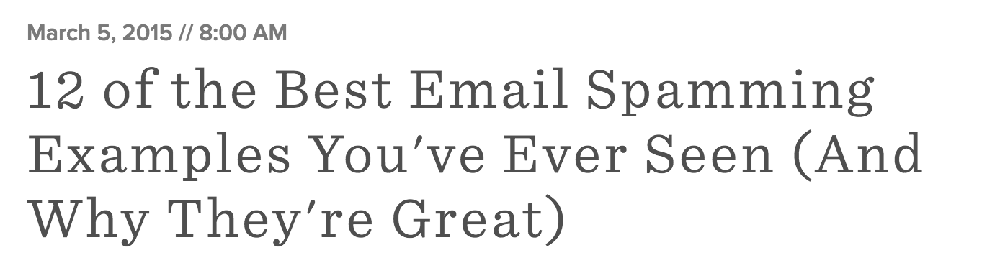

## Email to Spam Chrome extension

Chrome extension that replaces occurrences of 'email marketing' with 'email spamming'

[Direct download](https://github.com/rmlewisuk/email-to-spam/blob/master/EmailIsSpam.crx?raw=true)

## Installation

In Chrome, choose Window > Extensions.  Drag CloudToButt.crx into the page that appears.

## Example

## Why?

*"Email marketing facilitates spamming"*

I hate email marketing.

## Licence

[http://rmlewisuk.mit-license.org/](http://rmlewisuk.mit-license.org/)